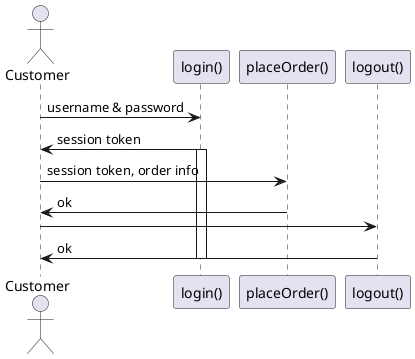

# Software engineering 1 Project
This project uses Java 11.
Change to your Java version in the pom.xml file.

<image src=Classdiagram.png>

```plantuml
@startuml
    actor Customer
    Customer -> "login()" : username & password
    "login()" -> Customer : session token
    activate "login()"
    Customer -> "placeOrder()" : session token, order info
    "placeOrder()" -> Customer : ok
    Customer -> "logout()"
    "logout()" -> Customer : ok
    deactivate "login()"
@enduml
```