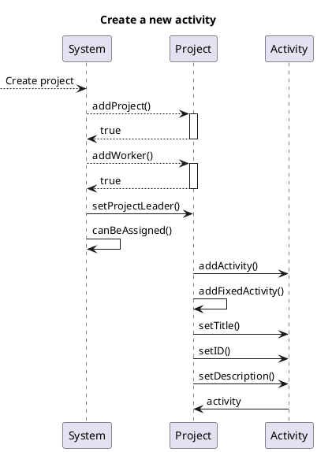

```plantuml

@startuml
title: Create a new activity
--> System : Create project

System --> Project : addProject()
activate Project 
return true
System --> Project : addWorker()
activate Project 
return true
System -> Project : setProjectLeader()

System -> System : canBeAssigned()
Project -> Activity : addActivity()
Project -> Project : addFixedActivity()
Project -> Activity : setTitle()
Project -> Activity : setID()
Project -> Activity : setDescription()
Activity -> Project : activity
@enduml


```
