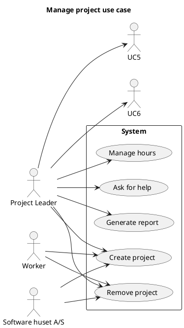
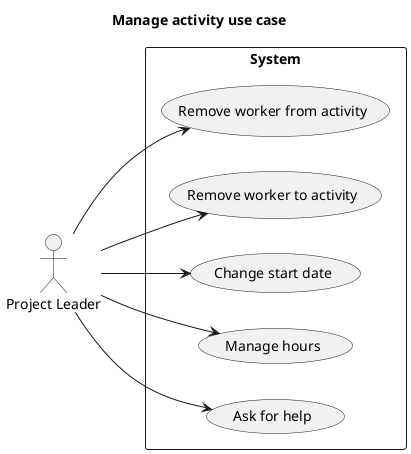
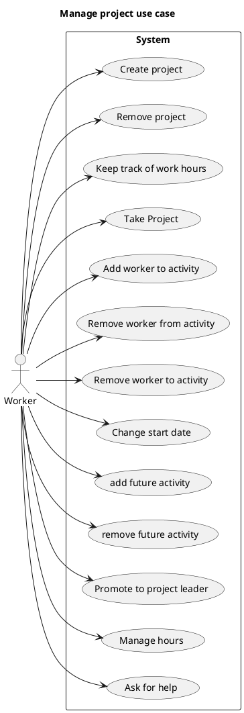
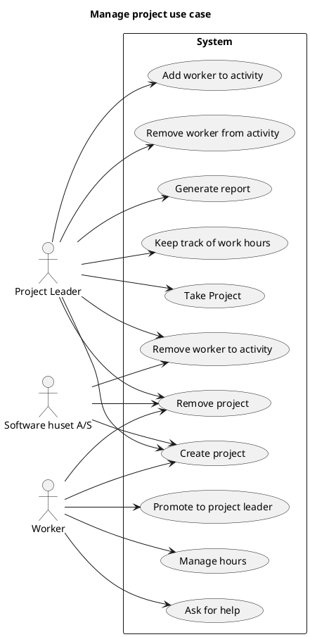

```plantuml
@startuml
left to right direction
title Manage project use case
actor "Project Leader" as pl
actor "Worker" as wo
actor "Software huset A/S" as sh

rectangle System {
  usecase "Create project" as UC1
  usecase "Remove project" as UC2
  usecase "Generate report" as UC3
  usecase "Manage hours" as UC4
  usecase "Ask for help" as UC7

}

pl --> UC1
pl --> UC2
pl --> UC3
pl --> UC4
pl --> UC5
pl --> UC6
pl --> UC7

sh --> UC1
sh --> UC2

wo --> UC1
wo --> UC2

@enduml
```

```plantuml
@startuml
left to right direction
title Manage activity use case
actor "Project Leader" as pl


rectangle System {

  usecase "Remove worker from activity" as UC1
  usecase "Remove worker to activity" as UC2
  usecase "Change start date" as UC3

  usecase "Manage hours" as UC4
  usecase "Ask for help" as UC5

}

pl --> UC1
pl --> UC2
pl --> UC3
pl --> UC4
pl --> UC5

@enduml


```

```plantuml
@startuml
left to right direction
title Manage project use case

actor "Worker" as wo

rectangle System {
  usecase "Create project" as UC1
  usecase "Remove project" as UC2
  usecase "Keep track of work hours" as UC3
  usecase "Take Project" as UC4
  usecase "Add worker to activity" as UC5
  usecase "Remove worker from activity" as UC6
  usecase "Remove worker to activity" as UC7
  usecase "Change start date" as UC8
  usecase "add future activity " as UC9
  usecase "remove future activity " as UC10
  usecase "Promote to project leader" as UC11
  usecase "Manage hours" as UC12
  usecase "Ask for help" as UC13

}


wo --> UC1
wo --> UC2
wo --> UC3
wo --> UC4
wo --> UC5
wo --> UC6
wo --> UC7
wo --> UC8
wo --> UC9
wo --> UC10
wo --> UC11
wo --> UC12
wo --> UC13

@enduml


```

```plantuml
@startuml
left to right direction
title Manage project use case
actor "Project Leader" as pl
actor "Worker" as wo
actor "Software huset A/S" as sh

rectangle System {
  usecase "Create project" as UC1
  usecase "Remove project" as UC2
  usecase "Generate report" as UC3
  usecase "Keep track of work hours" as UC4
  usecase "Take Project" as UC5
  usecase "Add worker to activity" as UC6
  usecase "Remove worker from activity" as UC7
  usecase "Remove worker to activity" as UC8
  usecase "Change start date" as UC9


  usecase "Promote to project leader" as UC9
  usecase "Manage hours" as UC10
  usecase "Ask for help" as UC11

}

pl --> UC1
pl --> UC2
pl --> UC3
pl --> UC4
pl --> UC5
pl --> UC6
pl --> UC7
pl --> UC8

wo --> UC1
wo --> UC9
wo --> UC2
wo --> UC10
wo --> UC11

sh --> UC8
sh --> UC2
sh --> UC1

@enduml


```