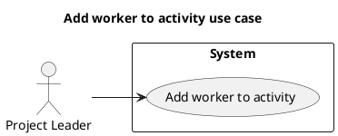
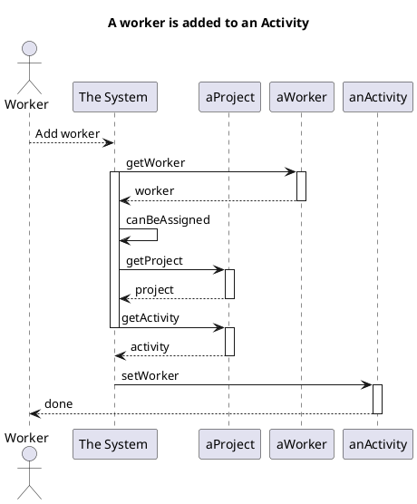

```plantuml
@startuml
left to right direction
title Add worker to activity use case
actor "Project Leader" as pl


rectangle System {
  usecase "Add worker to activity" as UC1


  
pl --> UC1


}

@enduml
<<<<<<< HEAD
```


```plantuml
@startuml
title  A worker is added to an Activity 

actor "Worker" as P
participant "The System " as S
participant "aProject" as aP
participant "aWorker" as aW
participant "anActivity" as aA


P --> S : Add worker
S -> aW : getWorker
activate S
  activate aW
  return  worker
  S -> S : canBeAssigned 
  S -> aP :getProject
    activate aP
    return project
  S -> aP : getActivity
  deactivate S
  activate aP
  return activity
  S -> aA : setWorker
  activate aA
    aA --> P : done
  deactivate aA
deactivate S
@enduml
```

=======
```
>>>>>>> f4508f782b7b8430adfd868b2cd03ba5a093b6d6
