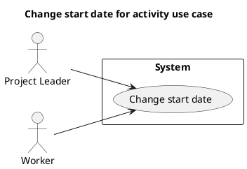
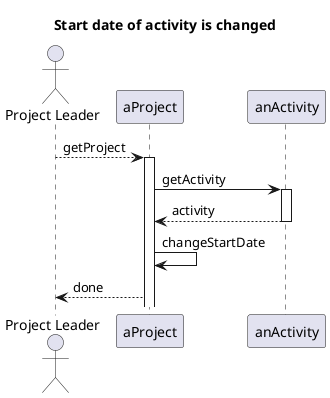

```plantuml
@startuml
left to right direction
title Change start date for activity use case
actor "Project Leader" as pl
actor "Worker" as wo

rectangle System {
  usecase "Change start date" as UC2
  
pl --> UC2
wo --> UC2

}


@enduml
```

```plantuml
@startuml
title  Start date of activity is changed

actor "Project Leader" as pl
participant "aProject" as aP
participant "anActivity" as aA


pl --> aP : getProject
activate aP
  aP -> aA : getActivity
  activate aA
  return activity
  aP -> aP : changeStartDate
aP --> pl : done
@enduml
```