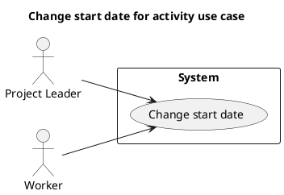
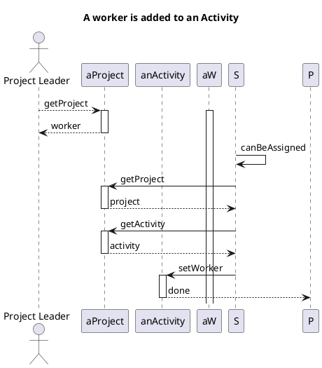

```plantuml
@startuml
left to right direction
title Change start date for activity use case
actor "Project Leader" as pl
actor "Worker" as wo

rectangle System {
  usecase "Change start date" as UC2
  
pl --> UC2
wo --> UC2

}


@enduml
```

```plantuml
@startuml
title  A worker is added to an Activity 

actor "Project Leader" as pl
participant "aProject" as aP
participant "anActivity" as aA


pl --> aP : getProject
activate aP
  activate aW
  return  worker
  S -> S : canBeAssigned 
  S -> aP :getProject
    activate aP
    return project
  S -> aP : getActivity
  deactivate S
  activate aP
  return activity
  S -> aA : setWorker
  activate aA
    aA --> P : done
  deactivate aA
@enduml
```