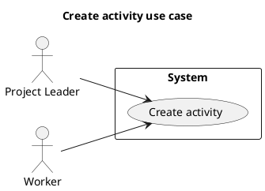
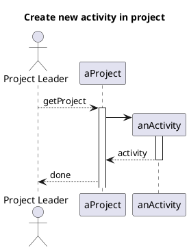

```plantuml
@startuml
left to right direction
title Create activity use case
actor "Project Leader" as pl
actor "Worker" as wo

rectangle System {
  usecase "Create activity" as UC3
pl --> UC3
wo --> UC3

}


@enduml
```

```plantuml
@startuml
title  Create new activity in project

actor "Project Leader" as pl
participant "aProject" as aP
participant "anActivity" as aA


pl --> aP : getProject
activate aP
  create aA
    aP -> aA
  activate aA
  return activity
aP --> pl : done

@enduml
```