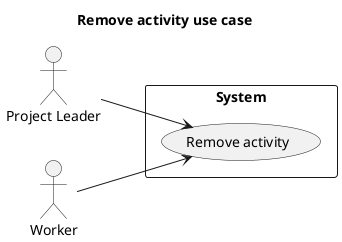
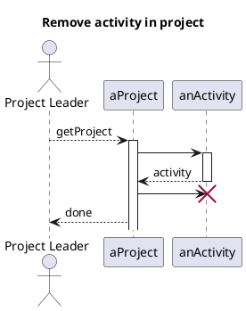

```plantuml
@startuml
left to right direction
title Remove activity use case
actor "Project Leader" as pl
actor "Worker" as wo


rectangle System {
  usecase "Remove activity" as UC4
pl --> UC4
wo --> UC4
}


@enduml
```

```plantuml
@startuml
title Remove activity in project

actor "Project Leader" as pl
participant "aProject" as aP
participant "anActivity" as aA


pl --> aP : getProject
activate aP
  
    aP -> aA
  activate aA
  return activity
  aP -> aA
  destroy aA
aP --> pl : done

@enduml
```