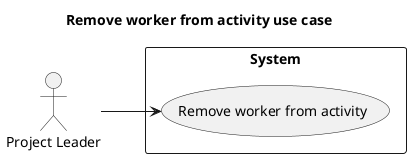
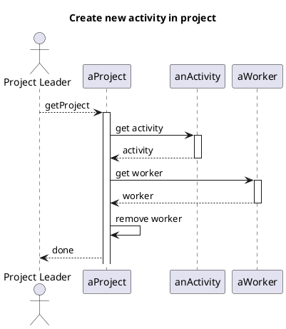

```plantuml
@startuml
left to right direction
title Remove worker from activity use case
actor "Project Leader" as pl

rectangle System {
  usecase "Remove worker from activity" as UC5


  
pl --> UC5

}


@enduml
```

```plantuml
@startuml
title  Create new activity in project

actor "Project Leader" as pl
participant "aProject" as aP
participant "anActivity" as aA
participant "aWorker" as aW


pl --> aP : getProject
activate aP
    aP -> aA : get activity
  activate aA
  return activity
  aP -> aW : get worker
  activate aW
  return worker
  aP -> aP : remove worker
aP --> pl : done


@enduml
```