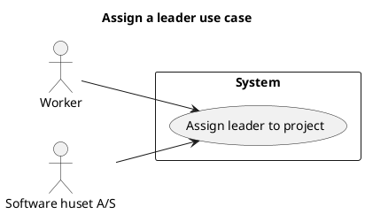
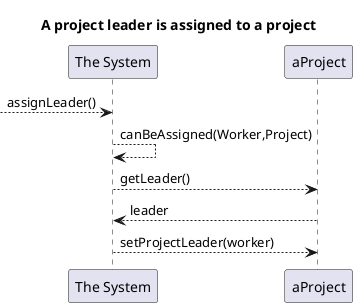

```plantuml
@startuml
left to right direction
title Assign a leader use case
actor "Worker" as wo
actor "Software huset A/S" as sh


rectangle System {
  usecase "Assign leader to project" as UC6

sh --> UC6
wo --> UC6

}

@enduml
```

```plantuml

@startuml
title  A project leader is assigned to a project
 
--> "The System" : assignLeader()
"The System" --> "The System"  : canBeAssigned(Worker,Project)
"The System" --> aProject : getLeader()
return leader
"The System" --> aProject : setProjectLeader(worker)

@enduml
```

