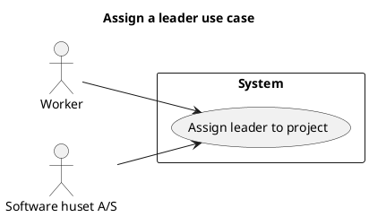
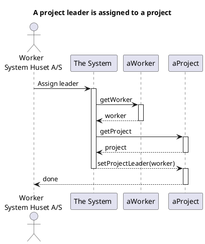

```plantuml
@startuml
left to right direction
title Assign a leader use case
actor "Worker" as wo
actor "Software huset A/S" as sh


rectangle System {
  usecase "Assign leader to project" as UC6

sh --> UC6
wo --> UC6

}

@enduml
```

```plantuml
@startuml
title  A project leader is assigned to a project

actor "Worker \n System Huset A/S" as P
participant "The System " as S
participant "aWorker" as W
participant "aProject" as aP


P -> S : Assign leader
activate S
S -> W : getWorker
activate W
return worker
S -> aP :getProject
activate aP
return project
S --> aP : setProjectLeader(worker)
deactivate S
activate aP
aP --> P : done
deactivate aP
@enduml
```

