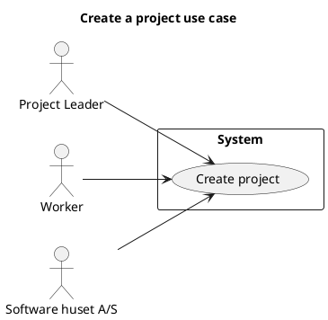
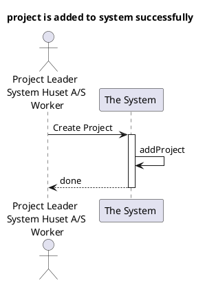

```plantuml
@startuml
left to right direction
title Create a project use case
actor "Project Leader" as pl
actor "Worker" as wo
actor "Software huset A/S" as sh


rectangle System {
  usecase "Create project" as UC7
  
pl --> UC7
sh --> UC7
wo --> UC7

}


@enduml
```

```plantuml
@startuml
title  project is added to system successfully

actor "Project Leader \n System Huset A/S \n Worker" as P
participant "The System " as S
P -> S : Create Project
activate S
S -> S : addProject
S --> P : done
deactivate S
@enduml
```