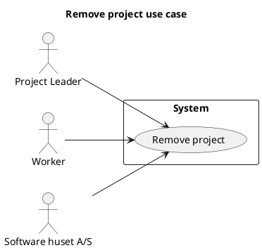
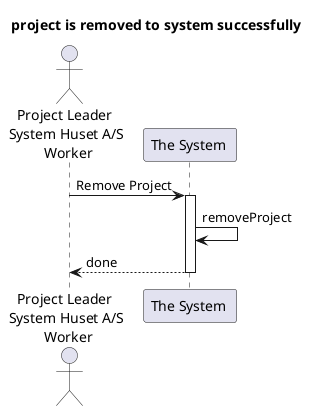

```plantuml
@startuml
left to right direction
title Remove project use case
actor "Project Leader" as pl
actor "Worker" as wo
actor "Software huset A/S" as sh


rectangle System {
  usecase "Remove project" as UC9
  
pl --> UC9
sh --> UC9
wo --> UC9

}


@enduml
```

```plantuml
@startuml
title  project is removed to system successfully

actor "Project Leader \n System Huset A/S \n Worker" as P
participant "The System " as S

P -> S : Remove Project
activate S
S -> S : removeProject
S --> P : done
deactivate S
@enduml
```
