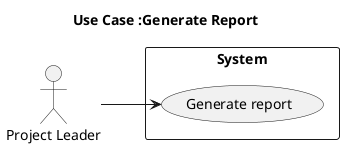
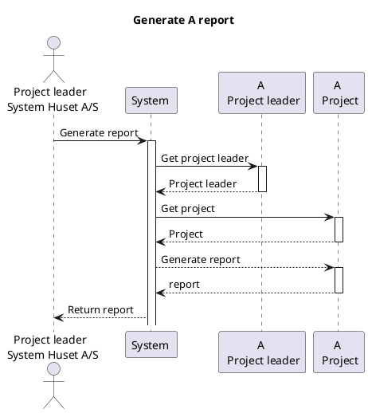

```plantuml
@startuml

left to right direction
title Use Case :Generate Report 
actor "Project Leader" as pl

rectangle System {
  usecase "Generate report" as UC10
}

pl --> UC10

@enduml
```

```plantuml
@startuml
title  Generate A report

actor "Project leader \n System Huset A/S" as P
participant "System " as S
participant "A \n Project leader" as W
participant "A \n Project" as aP


P -> S : Generate report
activate S
S -> W : Get project leader
activate W
return Project leader
S -> aP :Get project
activate aP
return Project
S --> aP : Generate report
activate aP
aP --> S : report
deactivate aP
S --> P: Return report
@enduml
```