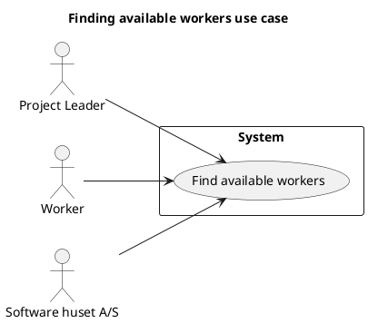
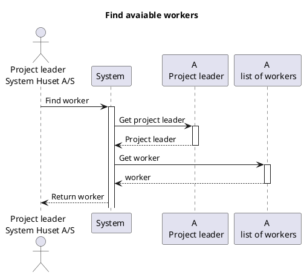

```plantuml
@startuml
left to right direction
title Finding available workers use case
actor "Project Leader" as pl
actor "Worker" as wo
actor "Software huset A/S" as sh


rectangle System {
  usecase "Find available workers" as UC15

pl --> UC15
sh --> UC15
wo --> UC15

}


@enduml
```

```plantuml
@startuml
title  Find avaiable workers

actor "Project leader \n System Huset A/S" as P
participant "System " as S
participant "A \n Project leader" as W
participant "A \n list of workers" as aP


P -> S : Find worker
activate S
S -> W : Get project leader
activate W
return Project leader
S -> aP :Get worker
activate aP
return worker
deactivate aP
S --> P: Return worker
@enduml
```