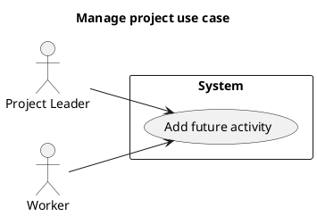
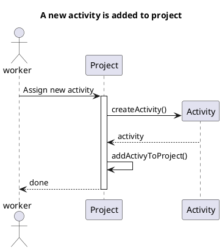

```plantuml
@startuml
left to right direction
title Manage project use case
actor "Project Leader" as pl
actor "Worker" as wo

rectangle System {
  usecase "Add future activity" as UC11  
  
pl --> UC11
wo --> UC11

}


@enduml
```

```plantuml
@startuml
title A new activity is added to project

actor worker as wo
participant "Project" as P


wo -> P : Assign new activity
activate P
create Activity
P -> Activity : createActivity()
Activity --> P : activity
P -> P : addActivyToProject()
return done
@enduml
```