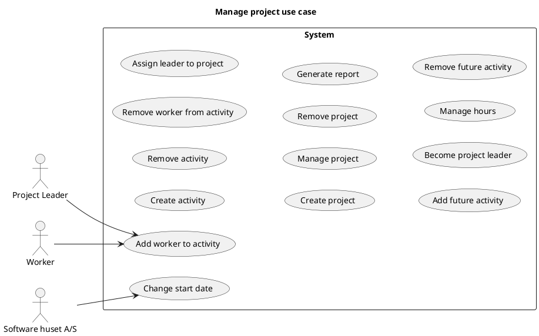

```plantuml
@startuml
left to right direction
title Manage project use case
actor "Project Leader" as pl
actor "Worker" as wo
actor "Software huset A/S" as sh


rectangle System {
  usecase "Add worker to activity" as UC1
  usecase "Change start date" as UC2
  usecase "Create activity" as UC3
  usecase "Remove activity" as UC4
  usecase "Remove worker from activity" as UC5
  usecase "Assign leader to project" as UC6
  usecase "Create project" as UC7
  usecase "Manage project" as UC8
  usecase "Remove project" as UC9
  usecase "Generate report" as UC10
  usecase "Add future activity" as UC11  
  usecase "Become project leader" as UC12
  usecase "Manage hours" as UC13
  usecase "Remove future activity" as UC14

  
pl --> UC1

sh --> UC2

wo --> UC1

}


@enduml
```

