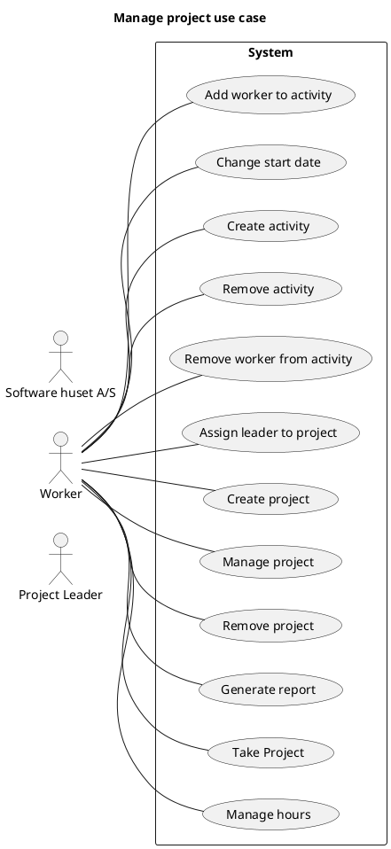

```plantuml
@startuml
left to right direction
title Manage project use case
actor "Project Leader" as pl
actor "Worker" as wo
actor "Software huset A/S" as sh


rectangle System {
  usecase "Add worker to activity" as UC1
  usecase "Change start date" as UC2
  usecase "Create activity" as UC3
  usecase "Remove activity" as UC4
  usecase "Remove worker from activity" as UC5
  usecase "Assign leader to project" as UC6
  usecase "Create project" as UC7
  usecase "Manage project" as UC8
  usecase "Remove project" as UC9
  usecase "Generate report" as UC10 
  usecase "Take Project" as UC11
  usecase "Manage hours" as UC12


  
wo -- UC1
wo -- UC2
wo -- UC3
wo -- UC4
wo -- UC5
wo -- UC6
wo -- UC7
wo -- UC8
wo -- UC9
wo -- UC10

wo -- UC11
wo -- UC12

}


@enduml
```

