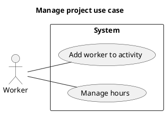

```plantuml
@startuml
left to right direction
title Manage project use case
actor "Worker" as wo


rectangle System {
  usecase "Add worker to activity" as UC1
  'usecase "Change start date" as UC2
  'usecase "Create activity" as UC3
  'usecase "Remove activity" as UC4
  'usecase "Remove worker from activity" as UC5
  'usecase "Assign leader to project" as UC6
  'usecase "Create project" as UC7
  'usecase "Manage project" as UC8
  'usecase "Remove project" as UC9
  'usecase "Generate report" as UC10 
  'usecase "Take Project" as UC11
  usecase "Manage hours" as UC12


  
wo -- UC1
wo -- UC12

}


@enduml
```

